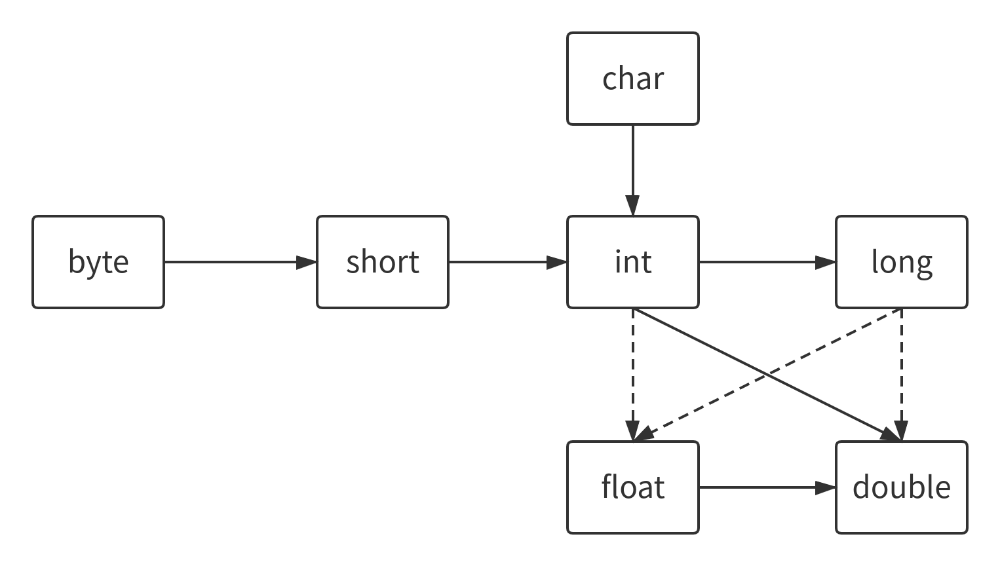

[toc]

# 前言

整个项目包括了《Java核心技术卷I》中的一些重要知识点笔记，以及相关的代码示范。由于在阅读《Java核心技术卷I》时，笔者已经有了一些面向对象程序语言的基础，所以在记录知识点时，可能对某些知识点并没有详细记录，笔记与代码也是从第三章开始记录。

整个项目开源于Github:[https://github.com/zengxilong/CoreJavaVolume_One](https://github.com/zengxilong/CoreJavaVolume_One)


# ch3-Java的基本程序设计结构

本章代码文件夹：[https://github.com/zengxilong/CoreJavaVolume_One/tree/master/src/ch3](https://github.com/zengxilong/CoreJavaVolume_One/tree/master/src/ch3)


## (一) 数据类型

### 1、整型

| 类型  | 存储需求 |                        取值范围                         |
| :---: | :------: | :-----------------------------------------------------: |
|  int  |  4字节   |     -2 147 483 648 ~ 2 147 483 647 （正好超过20亿）     |
| short |  2字节   |                    -32 768 ~ 32 768                     |
| long  |  8字节   | - 9 223 372 036 854 775 808 ~ 9 223 372 036 854 775 807 |
| byte  |  1字节   |                       -128 ~ 127                        |

+ 长整型数字后缀为L或者l，十六进制前缀为0x或者0X，八进制前缀为0，二进制前缀为0b或者0B。


### 2、浮点型

|类型|存储需求|取值范围|
|:---:|:---:|:---:|
|float|4字节|大约±3.402 823 47E+38F（有效位数6～7位）|
|double|8字节|大约±1.797 693 134 862 315 70E+308（有效位数15位）|


### 3、三个特殊浮点数值

**[DataType.java的第1部分](https://github.com/zengxilong/CoreJavaVolume_One/blob/master/src/ch3/DataType.java)**

+ 正无穷大
+ 负无穷大
+ Na

常量```Double.POSITIVE_INFINITY``` 、 ```Double.NEGATIVE_INFINITY```和```Double.NaN```分别表示上述三个特殊值，特别要说明的是，**不能判定一个特定取值是否等于NaN**

```java
nan == Double.NaN //永远都会是false
```
这是因为**所有非数值的取值都是不同的**，可以使用```Double.isNaN```来判断
```java
if (Double.isNaN(x))
```


### 4、浮点数的误差

**[DataType.java的第2部分](https://github.com/zengxilong/CoreJavaVolume_One/blob/master/src/ch3/DataType.java)**

浮点数不是用于对精度要求很高的计算中，例如下面代码：

```java
System.out.println(2.0-1.1) //输出2.0-1.1 结果
```
打印的结果是0.8999999999999999，而不是正确答案0.9。因为**浮点数采用二进制表示，二进制无法精确的表示1/10**，就像十进制无法精确表示1/3。这种情况可以采用```BigDecimal```替代，后面会有记录。


### 5、转义序列\u

**[DataType.java的第3部分](https://github.com/zengxilong/CoreJavaVolume_One/blob/master/src/ch3/DataType.java)**
转义序列\u会在***代码解析之前处理，先执行转义**，例如``` \u0022 ```对应双引号，因此:

```java
"\u0022+\u0022"
```
对应的字符串是```“”+“”```，也就是空串，而不是```“+”```字符串。


## (二)变量

### 1、变量名称
[Variable.java](https://github.com/zengxilong/CoreJavaVolume_One/blob/master/src/ch3/Variable.java)
+ java的变量以字母开头，但是字母的范围非常广，例如**‘A‘～’Z‘，’_‘，'$'以及一些语言特有的unicode字母，**但是$只用在java编译器和其他工具生成的代码中。
+ 查看这个字母是否可以用于变量名，可以**使用```Character```类中的```isJavaIdentifierStart```和```isJavaIdentifierPart`**``判断
+ 利用final来指示常量，**习惯上常量全大写**，如果在一个类中需要被多个方法使用，可以用 **```static final```**


## (三)运算符

### 1、模运算
[Operator.java代码第1部分](https://github.com/zengxilong/CoreJavaVolume_One/blob/master/src/ch3/Operator.java)

使用默认的%符号进行模运算会有一个问题，**当被除数为负数时，结果会返回负数。**这里考虑一个实际问题，做一个时间调整，计算一个时钟的时针位置。计算表达式可以是：

```java
(position + adjustment) % 12  //position表示当前位置，adjustment表示调整数
```

看似没有问题，但是当```adjustment```为负数时，```position+adjustment``` 可能为一个负数，解决方案就是将**（得到的负数结果+除数)%除数**，这样表达式就变成：

```java
( (position + adjustment) % 12 + 12 ) % 12
```

**Math.floorMod**方法简化了这一过程：

```java
Math.floorMod(position+adjustment, 12) //param1:被除数，param2:除数
```

但需要注意到是，如果除数为负数，那么```floorMod```也会得到负数结果，但这种情况比较少见。


### 2、Math常用函数

[Operator.java代码第2部分](https://github.com/zengxilong/CoreJavaVolume_One/blob/master/src/ch3/Operator.java)

常用三角函数

+ ```Math.sin```

+ ```Math.cos```

+ ```Math.tan```

+ ```Math.atan```

+ ```Math.atan2```

指数函数及其反函数

+ ```Math.exp```
+ ```Math.log```
+ ```Math.log10```

常数pi与e

+ ```Math.PI```
+ ```Math.E```


### 3、类型转换

[Operator.java代码第3部分](https://github.com/zengxilong/CoreJavaVolume_One/blob/master/src/ch3/Operator.java)

下图中给出了数值类型之间的合法转换，而三个虚箭头表示转换会有精度损失。



例如int-->float就可能会有精度丢失。

```java
int n = 123456789;
float f = n; // f is 1.23456792E8
```

当使用上面的数值进行二元操作时，会转换为同一种类型，优先级如下：

**```double > float > long > int```**


### 4、舍入

[Operator.java代码第4部分](https://github.com/zengxilong/CoreJavaVolume_One/blob/master/src/ch3/Operator.java)

强制类型转换可能会丢失一些信息，例如将```double```转换为```int```，将会直接**截断小数**部分，如果需要四舍五入，可以使用**```Math.round```**


### 5、枚举类型

[Operator.java代码第5部分](https://github.com/zengxilong/CoreJavaVolume_One/blob/master/src/ch3/Operator.java)

枚举类型变量只能存储给定的**某个枚举值**或者**null**

```java
enum Size{ SMALL, MEDIUM, LARGE, EXTRA_LARGE }; //在类外定义

Size s = Size.MEDIUM;
Size nu = null;
```


## (四)字符串

### 1、子串

[Str.java代码第1部分](https://github.com/zengxilong/CoreJavaVolume_One/blob/master/src/ch3/Str.java)

```java
//子串，param 1:起始位置，param 2:长度
String greeting="Hello";
String s = greeting.substring(0,3);
```


### 2、拼接

[Str.java代码第2部分](https://github.com/zengxilong/CoreJavaVolume_One/blob/master/src/ch3/Str.java)

使用```String.join```实现多个字符使用指定定界符拼接

```java
//param 1:定界符，param *:多个字符串
String all=String.join("/","S","M","L","X"); // all = "S/M/L/X"
```


### 3、不可修改性

[Str.java代码第3部分](https://github.com/zengxilong/CoreJavaVolume_One/blob/master/src/ch3/Str.java)

String类**没有提供用于修改字符串的方法**，如果希望修改字符串中的字符，只能见提取需要的字符串，然后拼接：

```java
String h = "Hello";
h = h.substring(0,3)+"p!"; // h = "Help!"
```

虽然不可以修改字符串，但是**可以修改字符串变量**，所以以下代码是可行的：

```java
String h = "Hello";
h = "Help!"; // h = "Help!"
```

对比与C++而言，java的字符串不像是C/C++中的字符数组：

```java
char greeting[] = "Hello";
```

而更像是一个char*指针，引用了字符串的内存。

```java
char* greeting = "Hello";
```

得益于java的自动垃圾回收机制，不需要担心内存泄露问题。


### 4、相同字符串判断

[Str.java代码第4部分](https://github.com/zengxilong/CoreJavaVolume_One/blob/master/src/ch3/Str.java)

**判断字符串是否相等，一定不能用```==```，而应该用```String.equals```**

之前也提到过，字符串变量是对字符串的引用，因此使用```==```只能判断这两个字符串变量引用的字符串在内存上的位置是否一致。但是在实际应用中，我们是需要判断两个变量的字面量是否相等，所以需要使用```String.equals```。

在虚拟机中，只有字符串常量是共享的，如：

```java
String a = "hello";
a = b;
```

那么a==b是可以的，但是如果使用```+```或者``` substring```等操作产生的结果是不共享的。例如：

```java
(greeting.substring(0,3)==greeting.substring(0,3))
```

==两边都是```greeting.substring(0,3)```，但是由于```substring```的结果不共享，所以这个表达式的返回值是```false```。而如果使用```equals```，则表达式为```true```。

```
greeting.substring(0,3).equals(greeting.substring(0,3))
```


### 5、空串与null

[Str.java代码第5部分](https://github.com/zengxilong/CoreJavaVolume_One/blob/master/src/ch3/Str.java)

空串不同于```null```，空串```""```是长度为0的字符串，而一个字符串变量为```null```，则表示没有任何对象与这个变量关联。如果需要检查既不是空串也不是```null```，则为：

```java
if(greeting!=null && greeting.length()!=0){
    TODO
}
```

注意需要首先判断是否为```null```，因为在```null```上调用方法会出错。


### 6、码点与代码单元

[Str.java代码第6-7部分](https://github.com/zengxilong/CoreJavaVolume_One/blob/master/src/ch3/Str.java)

**一个码点对应Unicode 代码空间中的一个值，而代码单元表示在具体编码形式中的最小单位，一个码点对应单个或者多个代码单元。**

``` String.length()```获得的是**代码单元数量**，想要获取字符串的字符数，则：

```java
int cpCount = greeting.codePointCount(0,greeting.length()) //param 1:开始位置 param 2:字符串长度（遍历的代码单元长度）
```

在String的方法中，如果方法名中不带```CodePoint```，一般都是操作的**代码单元**，例如```String.charAt(n)```返回的是位置```n```的代码单元。因此，如果需要**遍历字符串的码点**，则需要：

```java
int[] codePoints=cp.codePoints().toArray();
for(int i:codePoints){//码点遍历
    System.out.print(i+" ");
}
```

使用```codePoints().toArray()```转换为```int```数组，每一个元素对应一个码点。


### 7、StringBuilder

[Str.java代码第8部分](https://github.com/zengxilong/CoreJavaVolume_One/blob/master/src/ch3/Str.java)

有时需要由多个较短的字符串构建一个新的字符串，如果每次都连接字符串，效率会非常底下，可以使用```StringBuilder```来解决。

首先构建一个空的```StringBuilder```对象：

```java
StringBuilder builder=new StringBuilder();
```

然后使用```append```方法进行添加，可以支持多种类型：

```java
builder.appendCodePoint(120134);//添加码点
builder.append('1');//添加字符（代码单元）
builder.append("23");//添加字符串
builder.append(999);//添加数字
```

最后使用```toString```方法得到字符串：

```java
String buildString = builder.toString();
```


## (五)输入输出

### 1、读取输入

[IO.java代码第1部分](https://github.com/zengxilong/CoreJavaVolume_One/blob/master/src/ch3/IO.java)

首先使用```Scanner```对象关联标准输入流```System.in```：

```java
Scanner in = new Scanner(System.in);
```

然后可以使用```Scanner```类提供的各种输入操作，如```nextLine```读取一行，```next```读取单词，```nextInt```读取整数。

```java
System.out.println("What is you name?");
String name = in.nextLine();

System.out.println("How old are you?");
int age = in.nextInt();

System.out.println("Hello "+name+". Next year you'll be "+(age+1));
```


### 2、文件输出

[IO.java代码第2部分](https://github.com/zengxilong/CoreJavaVolume_One/blob/master/src/ch3/IO.java)

使用```PrintWriter```关联路径，路径直接为字符串：

```java
PrintWriter out = new PrintWriter("myfile.txt","UTF-8");
```

然后就可以进行输出：

```java
out.println("hello!");
out.write("write!");
out.append("append!");
out.close();
```

最后需要使用```close```方法关闭。


### 3、文件读取

[IO.java代码第3部分](https://github.com/zengxilong/CoreJavaVolume_One/blob/master/src/ch3/IO.java)

读取仍然需要```Scanner```，使用```Scanner```关联```Paths```：

```java
Scanner Fin = new Scanner(Paths.get("myfile.txt"),"UTF-8");
System.out.println(Fin.next());
System.out.println(Fin.next());
Fin.close();
```


### 4、异常

如果使用不存在的文件构建```Scanner```，或者用一个不能被创建的文件名构建一个```PrintWriter```，就会发生异常，需要在```main```方法中使用``` throws IOException ```：

```java
public static void main(String[] args) throws IOException {
    TODO
}
```


## (六)大数值

[BigValue.java代码](https://github.com/zengxilong/CoreJavaVolume_One/blob/master/src/ch3/BigValue.java)

### 1、BigInteger

使用静态方法```valueOf```可以将普通数值转换为大数值：

```java
BigInteger Inta = BigInteger.valueOf(99999999);
```

java**没有操作符重载功能**，四则运算为```add```,```subtract```,```multiply```,```divide```以及取余```mod```，比较```compareTo```

```java
Inta = Inta.multiply(BigInteger.valueOf(55));
```


### 2、BigDecimal

```BigDecimal```的静态方法```valueOf```，有一种重载需要传入两个参数（）：

```java
BigDecimal DecA = BigDecimal.valueOf(456,4);
//long x, int scale,返回 x/(10**scale)
```

`BigDecimal`的`divide`必须指定舍入模式，常用的四舍五入为`RoundingMode.HALF_UP`


## (七)数组

### 1、初始化

[Arr.java代码第1-2部分](https://github.com/zengxilong/CoreJavaVolume_One/blob/master/src/ch3/Arr.java)

数字数组初始化为`0`，`boolean`为`false`，`对象数组`为`null`。

数组有多种初始化方法，如：

```java
int[] smallPrimers = {2,3,4};
smallPrimers = new int[] {1,2,3,4,5,6};
```


### 2、数组长度可为0

[Arr.java代码第3部分](https://github.com/zengxilong/CoreJavaVolume_One/blob/master/src/ch3/Arr.java)

允许数组长度为`0`，这与`null`不同


### 3、数组拷贝

[Arr.java代码第4部分](https://github.com/zengxilong/CoreJavaVolume_One/blob/master/src/ch3/Arr.java)

之前在`String`类中讲过，变量都是引用，因此如果直接用`=`将一个数组变量赋值给另一个，那么这两个遍历会引用同一个数组：


如果只需要复制数组的值，则使用`copyOf`：

```java
int[] Prim = {0,1,2,3,4};
int[] notCopy = Arrays.copyOf(Prim,Prim.length * 2); //第二个参数为新的数组长度，超出的部分与数组初始化内容相同
```


### 4、优化版快排

[Arr.java代码第5部分](https://github.com/zengxilong/CoreJavaVolume_One/blob/master/src/ch3/Arr.java)

`Arrays.sort(x)`，更改会直接操作于`x`上。


### 5、for each在多维数组的用法

[Arr.java代码第6部分](https://github.com/zengxilong/CoreJavaVolume_One/blob/master/src/ch3/Arr.java)

第一层的遍历类型应该为数组：

```java
for(int[] row:magicSquare){
    for(int val:row){
        System.out.print(val+" ");
    }
    System.out.println();
}
```


### 6、快速打印数组

[Arr.java代码第7部分](https://github.com/zengxilong/CoreJavaVolume_One/blob/master/src/ch3/Arr.java)

```java
//Arrays.deepToString可以快速打印
System.out.println(Arrays.deepToString(magicSquare));
```


### 7、不规则数组

Java支持不规则数组，以二维数组为例，每一个元素引用数组的长度可以不同。


# ch4-对象与类

本章代码文件夹[https://github.com/zengxilong/CoreJavaVolume_One/tree/master/src/ch4](https://github.com/zengxilong/CoreJavaVolume_One/tree/master/src/ch4)
